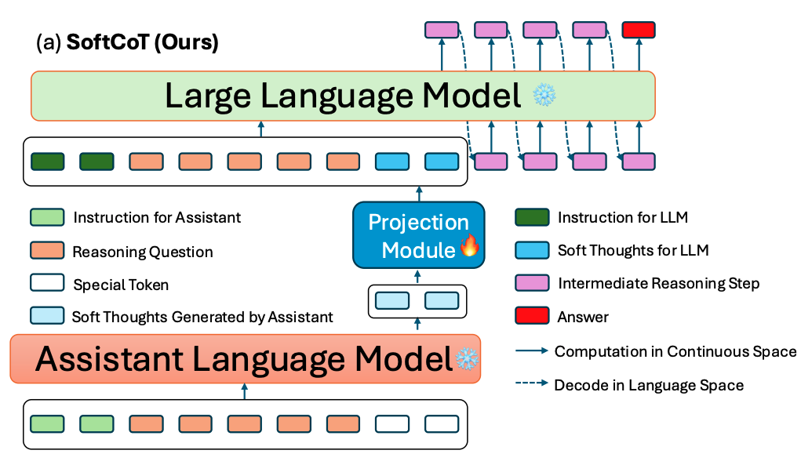

<div align="center">
<h1>SoftCoT: Soft Chain-of-Thought for Efficient Reasoning with LLMs</h1> 
</div>

<p align="center">
<a href="https://arxiv.org/abs/2502.12134">
  </a>
<br>
<b>Authors:</b>
<a href="https://xuyige.github.io">Yige Xu</a>,
<a href="https://guoxuxu.github.io/">Xu Guo</a>,
<a href="https://scholar.google.com/citations?user=6eiLXmcAAAAJ">Zhiwei Zeng</a>,
<a href="https://scholar.google.com/citations?user=fmXGRJgAAAAJ">Chunyan Miao</a>.
</p>

## Overview

*How can we apply CoT in continuous space with LLMs?* —— We say **SoftCoT**!

We introduce ***SoftCoT***, a simple yet effective approach that enables LLMs to perform reasoning in continuous space while simultaneously mitigating the issue of catastrophic forgetting.

SoftCoT operates by first employing a lightweight assistant language model to generate soft thoughts—intermediate representations that capture nuanced reasoning patterns. These soft thoughts are then projected into the embedding space of the target LLM via a dedicated projection module. This process not only supports reasoning in a continuous latent space but also preserves previously learned knowledge, thereby enhancing the robustness and adaptability of the LLM.



## Quick Start

### Setup and Dependencies

Requirements:

- fastNLP==0.7.0
- torch==2.4.1
- transformers==4.44.2

### Prepare Data

Take math reasoning as example, we need to preprocess the data under the GSM8K-style, which is shown in ```./data/gsm8k```.

### Train

Here we use GSM8K as an example, for Llama, we have:

```bash
CUDA_VISIBLE_DEVICES=0 python train.py \
    --large_model_id meta-llama/Llama-3.1-8B-Instruct \
    --small_model_id meta-llama/Llama-3.2-1B-Instruct \
    --output_name [Output Name] \
    --batch_size 4 \
    --task_name gsm8k \
    --num_thought_tokens 4 \
    --n_epochs 10 \
```

For Qwen, we have:

```bash
CUDA_VISIBLE_DEVICES=0 python train.py \
    --large_model_id Qwen/Qwen2.5-7B-Instruct \
    --small_model_id Qwen/Qwen2.5-1.5B-Instruct \
    --output_name [Output Name] \
    --batch_size 4 \
    --task_name gsm8k \
    --num_thought_tokens 4 \
    --n_epochs 10 \
```

The ```output_name``` argument is used to differentiate between various experimental settings.

**Notice**: The training script is under the single-GPU style, we do not adopt our code to multi-GPU training.


### Evaluation

After the training stage, we will save to projection module, which can be used for evaluation:

```bash
bash run_batch.sh \
    --base_model_id meta-llama/Llama-3.1-8B-Instruct \
    --assistant_model_id meta-llama/Llama-3.2-1B-Instruct \
    --params_file_name [Dir to Your Ckpt]/projectin.bin \
    --num_thought_tokens 4 \
    --num_return_sequences 1 \
    --task_name gsm8k \
    --seed_from 41 \
    --seed_to 45 \
    --print_input \
    --print_response \
    --log_dir [Dir to Your Log File] \
    --run_name [Experiment Running Name, Default is Empty]
```

In this script we conduct evaluation with 5 random seeds from 41 to 45 under the control of argument ```seed_from``` and ```seed_to```. If you want to run only once, you can keep the two arguments same.


## Citation
```
@article{xu2025softcot,
  title={{SoftCoT}: Soft chain-of-thought for efficient reasoning with llms},
  author={Xu, Yige and Guo, Xu and Zeng, Zhiwei and Miao, Chunyan},
  journal={arXiv preprint arXiv:2502.12134},
  year={2025}
}
```

